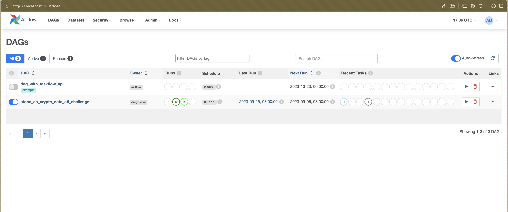
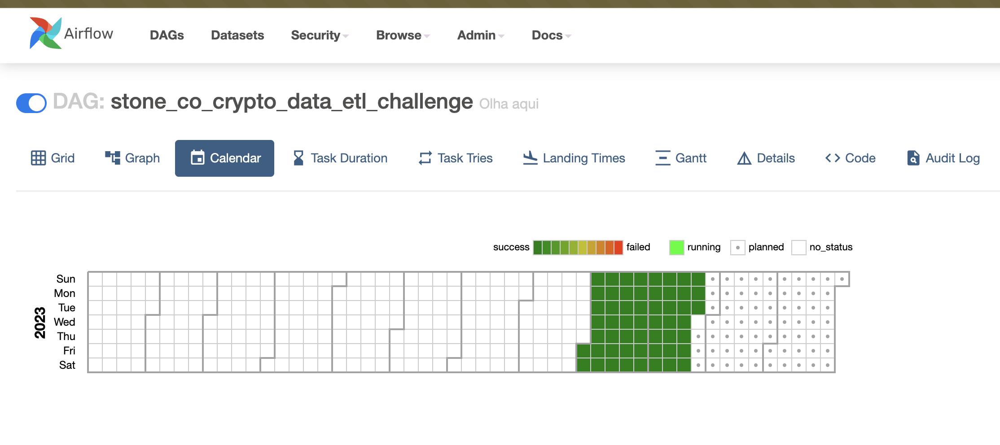
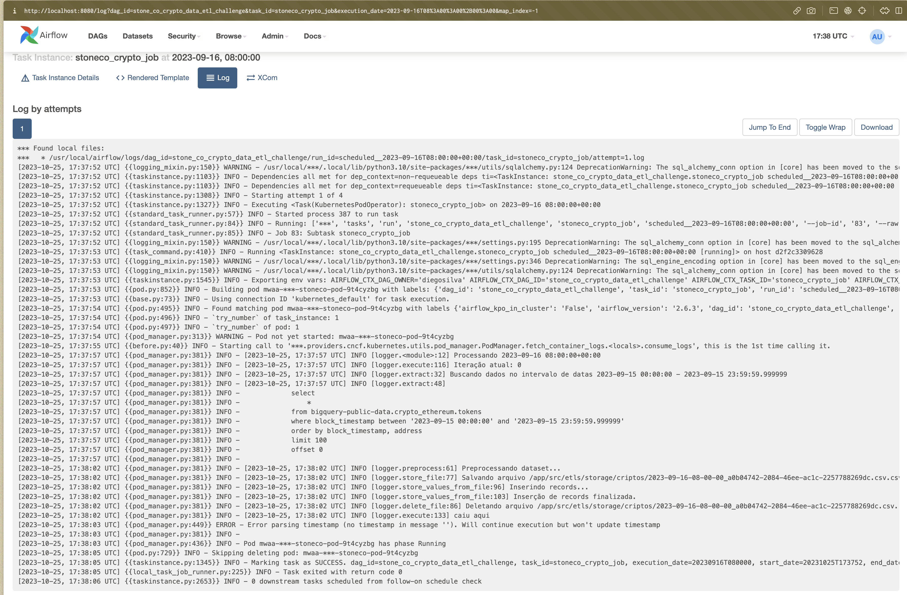

# Stone Co Crypto Data Challenge

Este projeto contém os artefatos utilizados durante a execução de um teste técnico para a posição de Senior Software Engineer - Risk.

## Requisitos

- Docker
- Kubernetes
- Helm
- Google Cloud Platform Service Account com os seguintes privilégios ao BigQuery:
  - BigQuery Data Viewer
  - BigQuery Job User

## Como utilizar

Ao obter o service account, coloque-o dentro da pasta `./crypto_etl/` do projeto. Ele deverá ser especificado no passo seguinte. O caminho especificado deve ser o nome do arquivo obtido.

**1.** Defina as seguintes variáveis de ambiente para o seu projeto:

- `POSTGRES_DB`: Nome do banco de dados a ser utilizado para os dados no Postgres;
- `POSTGRES_USER`: Nome de usuário desejado para o postgres;
- `POSTGRES_PASS`: Senha desejada para o postgres;
- `POSTGRES_HOST`: DNS do serviço do Postgres entregue ao Kubernetes. Default: `postgres-postgresql.postgres.svc.cluster.local`;
- `POSTGRES_PORT`: Porta configurada no serviço do Postgres. Default: `5432`;
- `GCP_CREDENTIALS_PATH`: Caminho para o arquivo _JSON_ do serviço account obtido no GCP;
- `CRIPTO_ETL_RECORD_LIMIT`: Define quantas observações serão pegues, no máximo, a cada iteração. O programa considerará 100 como _default_.

*Dica: Você pode fazer isso através da criação de um arquivo `.env` e depois aplicar `source CAMINHO_PARA_ARQUIVO_VENV_CRIADO`*

**2.** Substitua os valores definidos acima no arquivo `postgres_values.yaml`:

- `global.postgresql.auth.username: $POSTGRES_USER`
- `global.postgresql.auth.password: $POSTGRES_PASS`
- `global.postgresql.auth.database: $POSTGRES_DB`
- `primary.initdb.scripts.setup_table.sh`
```
scripts: 
      setup_tables.sh: |
        #!/bin/bsh
        export PGPASSWORD=$POSTGRES_PASS
        psql --username postgres -d stoneco <<-EOSQL
```


**3.** Edite o arquivo `./aws-mwaa-local-runner/docker/config/.env.localrunner` adicionando os seguinte conteúdo:

    AIRFLOW_VAR_GCP_CREDENTIALS_PATH=$GCP_CREDENTIALS_PATH
    AIRFLOW_VAR_POSTGRES_STONECO_DB=$POSTGRES_DB
    AIRFLOW_VAR_POSTGRES_STONECO_HOST=$POSTGRES_HORT
    AIRFLOW_VAR_POSTGRES_STONECO_PASS=$POSTGRES_PASS
    AIRFLOW_VAR_POSTGRES_STONECO_PORT=$POSTGRES_PORT
    AIRFLOW_VAR_POSTGRES_STONECO_USER=POSTGRES_USER
    AIRFLOW_VAR_CRIPTO_ETL_RECORD_LIMIT=$CRIPTO_ETL_RECORD_LIMIT


Substitua as variáveis com os valores definidos no passo 1.

**3.** Conceda permissão de execução ao arquivo `stoneco-crypto`;

**4.** Execute `./stoneco-crypto build-project` para preparar o projeto que será executado no Airflow;

**4.** Inicie o Airflow executando `./stoneco-crypto start`;


**5.** Navegue até `localhost:8080`, realize login no Airflow com as credenciais abaixo e ligue a DAG correspondente ao desafio.

- Username: admin
- Senha: test
  

## Visualização DAG funcionando





## Visualização Rotina Inserindo Dados




## Visualização Dados no Postgres


